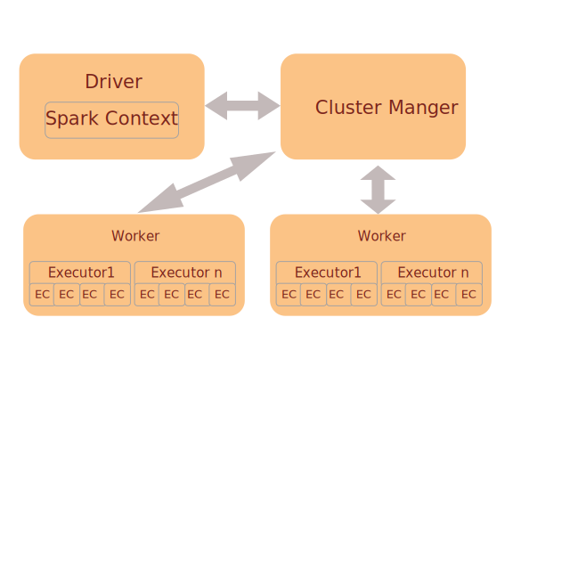

1. <h4> What is Apache sprak? </h4>

      Apache Spark is an _**open-source distributed general-purpose cluster-computing**_ framework. 
      It is a _**fast, in-memory data**_ processing engine, which allows _**data workers**_ to effciently 
      exeucte _**SQL, Machine learning and Streaming**_ workload which require fast _**iterative access**_ to data.
      
2.  <h4>What is the diffrence between Hadoop and Spark? </h4>

      <h5> All major diffrences can be explained with how an Iterative Data Algorithms is used on the Data </h5>
      
      **Spark** is an _**in-memory data processing engine**_, hence spark to _**cache data**_ in the memory for further processing of the data.
      This enables spark to be higly efficeint when processing data with _**iterative algorithms**_.
      
      **Hadoop** application are traditional MapReduce jobs where data is passed via _**HDFS**_ across iterations. 
      And hence the data cannot be cached in-memory.
      
      **Spark** can process algorithms with multiple passes on data, where the result of the previous execution is used as input 
      for the next pass.
      
      **Hadoop** is limited by the means which the data can be shared between ```(Map -> Reduce) => (Map -> Reduce)``` jobs. ```'=>'``` the data flow
      is via HDFS.
      
      **Spark** executor can be reused when perfroming iterative processing as executior cores will be replaced with new threads
      tasked in perfomring the new data processing. Spark creates a DAG of tasks and the data is in Memory and not written to Disk 
      in between diffrent tasks of the DAG.
      
      **Hadoop** the JVM can be reused between MR tasks spawned on the same worker, however this is subtely diffrent and needs knowledge of 
      the hadoop configuration parameter ```"mapred.job.reuse.jvm.num.tasks"```.
      
       
3.  <h4> What is the high level overview of Execution Model of Spark?</h4>
      
      
      
      - **Driver**
      This is the **main** program of the Spark Application. It **instantiates a SparkContext**. Based on the Spark Application code in the driver, A **logical plan** is created which is used to **create a DAG** which translates to an **Execution Plan** which is divided into **stages** consiting of **tasks** which will be **executed on the Workers**.
      There is no data processing happening in the driver.

      - **Spark Context**
      This serves as an link or bridge which enables the Driver to communicate with the Cluster Manger. Some possible
      examples of SparkContext's use are **Negotiate Resources**, **Change Mmemory, cores requested in executors**, **create RDDs on cluster, Create Accumulators, Create Broadcast variables**.

      - **Cluster Manger**
      Is a resource manager which is aware of the distributed workers in the cluster and its resources. It also serves as
      a resource negotiator for the Spark Application. The clsuter manger decides which tasks are schedueld on which worker nodes based on the data avaible on the node.

      - **Workers**
      Are distributed nodes in the cluster, the workers have a cretain capacity based on the Meomory/CPU avaible on the machines.
      
      - **Executors**
      Is an Java process, For example an JVM running in an Yarn container. This is where the data processing happens.
 
      - **Executor Cores**
      Number of threads which each container can run to process the tasks
      
 4. <h4> What are the available Cluster Mangers for Spark? </h4>
 
       - YARN. From the hadoop world, Works as a Resource manger.
       
       - Mesos.
       
       - Standalone.
     
